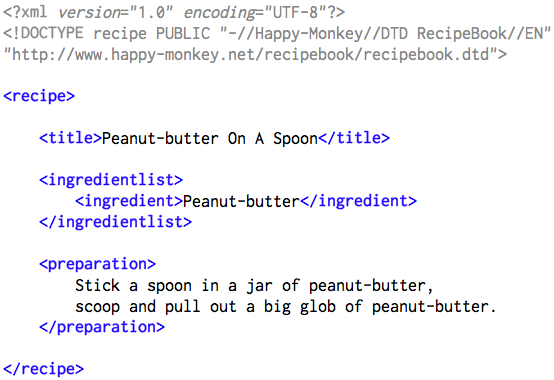
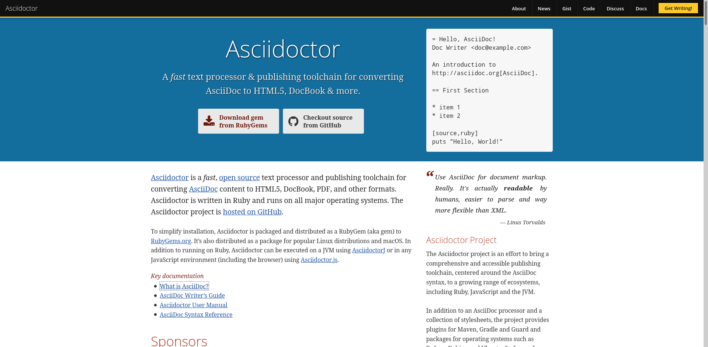
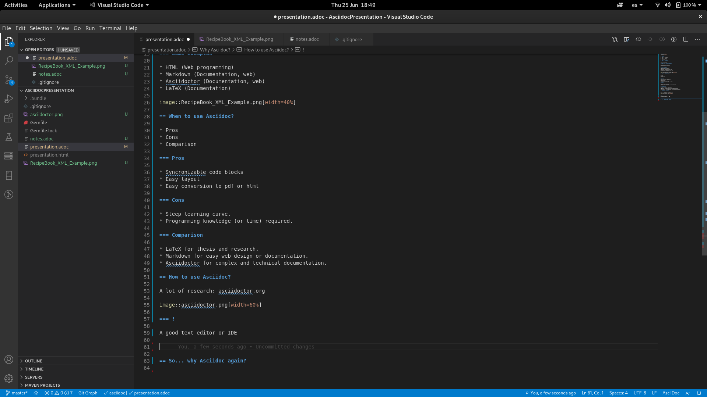

= Why Asciidoc?
:backend: revealjs

== Agenda

1. What is Asciidoc?
2. When to use it?
3. How to use it?

== What is Asciidoc?

A markup language

=== What is a markup language?

* Computer language
* Tags to define elements

=== Some examples

* HTML (Web programming)
* Markdown (Documentation, web)
* Asciidoctor (Documentation, web)
* LaTeX (Documentation)

== When to use Asciidoc?

* Pros
* Cons
* Comparison

=== Pros

* Syncronizable code blocks
* Easy conversion to pdf or html
* Open source
* Version control

=== Cons

* Steep learning curve.
* Programming knowledge (or time) required.

=== Comparison

* LaTeX for thesis and research.
* Markdown for easy web design or documentation.
* Asciidoctor for complex and technical documentation.

== How to use Asciidoc?

=== !

A lot of research: asciidoctor.org

=== !

A good text editor or IDE and...

=== !

Practice

== So... why Asciidoc again?

=== !

Hard to master, but

=== !

It is the most powerful tool to write technical documentation.

== Thank you